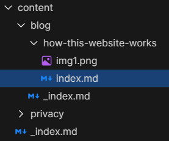

Well, I've been asked recently on [Retrospring](https://retrospring.net/@MiaWinter) how my website works, and I've been thinking
about doing a blog for a while so, here goes to adding to the noise polution of the world wide web.

# The Webserver

Before there is a website, there needs to be a host. I just rented a webserver on a big German data-provider, got a lil linux ubuntu with 2gb ram,
2 cores and a lil bit ssd space (30 gigs or so). On it I installed docker with docker-compose and wrote a lil compose that installes a couple nginx
container to serve my sites internally (miawinter.de, winter-software.com and mastograph.miawinter.de) and then set up two containers for nginx-proxy
and acme-companion. nginx-proxy looks for other container with an environment variable set and then adds a proxy entry for that container, and
companion also looks for an environment variable and then asks let's encrypt for a ssl certificate and installs it into nginx-proxy.

I know of these thingies thanks to [Natty](https://natty.sh), she is the cutest and bestest and my math princess with all the knowledge.

For your convenience, here a quick look how such a docker-compose looks like:

{}
```yaml
version: '3.4'

services:
    # Hosting Reverse Proxy
    nginx:
        container_name: nginx
        restart: unless-stopped
        image: jwilder/nginx-proxy:alpine
        ports:
            - "80:80"
            - "443:443"
        volumes:
            - /var/run/docker.sock:/tmp/docker.sock:ro
            - certs:/etc/nginx/certs:ro
            - conf:/etc/nginx/conf.d
            - vhost:/etc/nginx/vhost.d
            - html:/usr/share/nginx/html
        environment:
            - DHPARAM_GENERATION=false
    acme-companion:
        container_name: acme-companion
        restart: unless-stopped
        image: nginxproxy/acme-companion
        volumes:
            - /var/run/docker.sock:/var/run/docker.sock:ro
            - certs:/etc/nginx/certs:rw
            - conf:/etc/nginx/conf.d
            - vhost:/etc/nginx/vhost.d
            - html:/usr/share/nginx/html
            - /etc/acme.sh:/etc/acme.sh
        environment:
            - DEFAULT_EMAIL=[<YOUR EMAIL HERE>]
            - NGINX_PROXY_CONTAINER=nginx
        depends_on:
            - nginx

    # here goes your websites
    your-site:
        container_name: your-site
        restart: unless-stopped
        image: nginx:alpine
        volumes:
            - /*[<Your website files>]*/:/usr/share/nginx/html
        environment:
            - VIRTUAL_HOST=[<Your Domain>]
            - LETSENCRYPT_HOST=[<Your Domain>]
            - NGINX_HOST=[<Your Domain>]
        depends_on:
            - acme-companion
volumes:
    # nginx reverse proxy and acme companion
    conf:
    vhost:
    html:
    certs:
    acme:
```
{}

There are a lot of network mounts, but those are needed for acme-companion and nginx-proxy to comunicate, since negotiating a certificate
requires a couple of challanges that are a pain otherwise.

I also usually set up networks and links explicitly, but that's just my petpevee, when you only host a couple sites dockers bridge will be
enough.

# The Website Generator

This website uses [Hugo](https://gohugo.io) to generate the website and metadata stuff from markdown files. Hugo is made in GO and uses GOs
HTML templates which is very nice and easy to use. In order to get a site running, you just need a baseof.html file in the layouts/_default
folder and a single.html and list.html with that output content generated from markdown with a `{{ .Content }}` action, and you are good to go.

Following is a bad explanation of how hugo works, you may skip it.

baseof.html contains the boilerplate code, the html tag, header and some body, in my case with a navbar and a footer. Then you can define blocks,
you usally do a main block, that get's populated in single.html and list.html. Hugo differentiates between two types of content pages mainly,
a single page is basically a node it content, a single article, like this page you are on currently, a list page is a page listing all the single
pages available on that level and i think also other deeper lists. So for this block, in my content folder, there is a folder named blob, hugo uses
list.html to generate a page from that and gives me all the blogs in the folder, and for all the files in the blog folder, it generates a page with
single.html. A folder can container either a `_index.md`, a `index.md` or a `some name.md`. The first just gives hugo additional info for the
list-page, you can put it's content in your list template, for example, my /blog page has a little introductory text, that's in `/blog/_index.md`.
The `index.md` is special, so first let's talk about `some name.md`, everything that's not called index is treaded as content for a single page,
so if you have `blog1.md` and `blog2.md` in your blogs folder, hugo will generate one list page for blogs, which you may use to link to two
single pages, generated out of these two files. `index.md` is special in that, it tells hugo that the directory we are in is not a list, but a page,
why do that? Well, sometimes you have resources like images that are only used in one page. Normally you put static resources in the static folder,
but when you write many blogs with illustrations, that folder will get bloated with one-time-use assets. When you create a folder and put an
`index.md` in it, hugo will use the folder name as a path-node, the content in the index file will be the content of the single-page and everything
else in the folder will be available as a resource to just that index.md, hugo calls this a page-bundle, and I really like it!

Here is how this pages content structure looks right now:



And the img1 is the screenshot you see, which I can use just in this index.md with `[](img1.png)` (is this a fourth wall break?). As I said, I love
page bundles.

My explanation is probably not a good hugo tutorial, but hugo has very nice docs with a lot of code examples and even explenatory videos, definetly
check it out!

# The Website Itself

The Website uses postcss with tailwind, you find the instruction how to set it up here:
[tailwind postcss docs](https://tailwindcss.com/docs/installation/using-postcss). You usally also want autoprefixer which fixes some stuff.

On how to get all that stuff, I just used npm, running something like `npm i -D postcss tailwindcss autoprefixer`, also installed tailwinds
typograhpy plugin, since it is really nice with hugos content generation, you just add it in single.html above your content and everything looks
like, well, this! As for making things look nice, I used the [daisyUI](https://daisyui.com/) plugin for tailwind and made my own theme for it
(their website has a nice generator to get you started). Getting used to tailwind took a while, but it's really nice once you got it, you can
style a website pretty fast and make it very responsive. For example, the navbar on top has the menu (generated with the help of hugo menus) twice,
one is the regular horizontal menu you see on desktop, with a `max-md:hidden`, so it's not visible on devices with like less than 900px width
(or something like that), the second menu is a dropdown component with a burger menu icon as it's button to open it
(thanks [heroicons](https://heroicons.com)), this one has `md:hidden` which hides it on desktop (like 900px upwards), so on mobile you see the
dropdown, and on desktop the expaneded menu (except when you zoom in a lot), easy peasy! And it's all CSS! Even daisyUIs dropdown is pure CSS, it
leverages the active state of labels and checkboxes a lot which is very neat, I am especially impressed with the drawer component
(not used on this site).

Appart from that there are just some lil plugins to postcss for optimization like previously mentioned autoprefixer or cssnano to minify the
resulting css file.

So this site mostly uses the components given by daisy, with some tailwind stuff to make it cooler.
In the end I run my css:build npm script, it generates the index file with my customizations, settings and themes, cssnano minimizes it,
and then in hugo I load it as a resource and fingerprint it for caching and security.

# Summary

So yeah, here you have it. A linux machine with docker, a nice docker compose, hugo to generate html and tailwind/daisyui to style it.
Getting that stack together took some time, since I leared a lot of this tech along the way, but having it all in place, it feels way nicer
than any CRM, it's nice, small and very performat, and I can modify it easily.

Maybe you want to do like me, maybe you just buy a webserver with concrete, maybe you will use WordPress (Please don't I beg you), anyway,
hosting a website is pretty easy in this day and age, so don't be scared, learning it is fun!

## Update 2023-02-25

I put up my Site on GitHub! You can now have a look at it [here](https://github.com/miawinter98/miawinter.de)